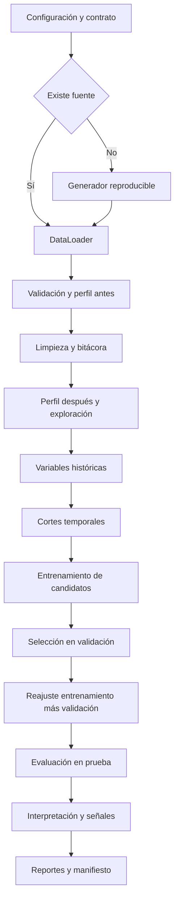
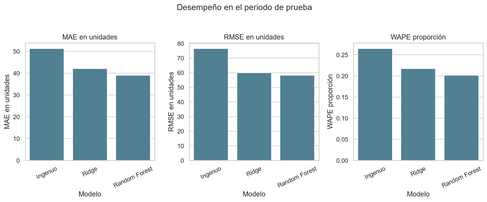
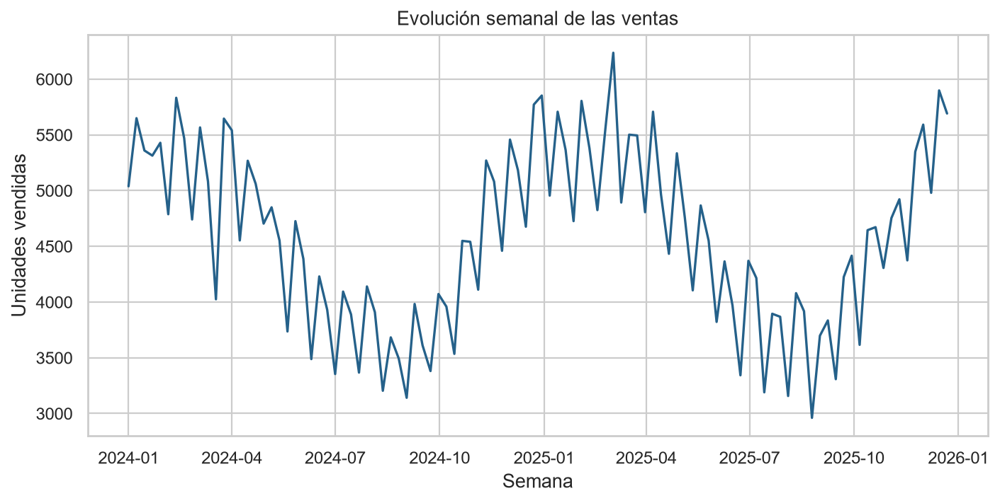
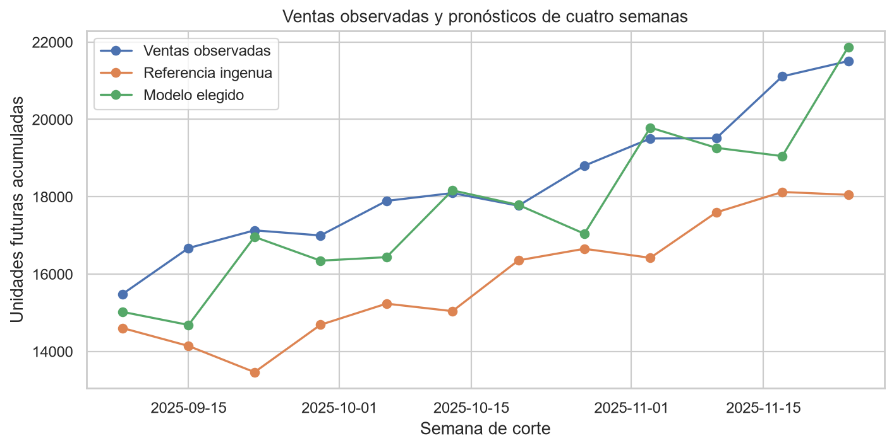

# Framework Lumina para pronóstico de ventas

Prototipo funcional en Python del proyecto final de Programación para la inteligencia artificial. Estima ventas acumuladas de las cuatro semanas siguientes por producto y sucursal, compara una regla histórica con Ridge y Random Forest y genera señales para revisar inventario.

El proyecto final continúa el trabajo del [Avance 2](https://github.com/rubenstrada/Dise-o-framework-), que se conserva como antecedente. Primero revisé los datos, después los limpié y preparé, y finalmente comparé los modelos con una regla histórica sencilla.

## Alcance y relación con el documento

El caso describe a Lumina Datos Operativos y Red Comercial Boreal, pero no entrega una fuente tabular. Para comprobar el flujo, se simularon los datos de un escenario de 20 productos, 5 sucursales y 104 semanas, con semilla 42. Las columnas y reglas pertenecen a este prototipo; los resultados no son hallazgos empresariales reales. Esta nota aplica a todas las figuras y tablas.

El Word conserva las doce instrucciones seguidas de sus respuestas. La [versión navegable del reporte](docs/proyecto_final.md) sigue el mismo orden. La repo complementa el documento con código, configuración, pruebas y artefactos que pueden ejecutarse y revisarse.

El objetivo es venta observada, no demanda ilimitada: las ventas pueden quedar censuradas por inventario. Las señales no son órdenes de compra y el desempeño predictivo no demuestra rentabilidad.

## Ejecutar

Desde la raíz del repositorio:

```powershell
python -m pip install -r requirements-lock.txt
python -m pip install -e . --no-deps
python scripts/run_final_project.py --config config/project_final.yaml
python -m pytest -q
```

`requirements-lock.txt` contiene las versiones utilizadas de las dependencias directas; `pyproject.toml` declara los requisitos del proyecto.

La fuente versionada permite repetir sin descargar datos. Si `source_path` no existe, el generador crea el escenario; si existe, se carga sin sobrescribirlo. Cambiar la semilla no modifica un CSV existente. El manifiesto distingue parámetros solicitados y metadatos de generación, y registra el hash de la fuente utilizada.

Resultados en [`artifacts/project_final/`](artifacts/project_final). Para reconstruir el texto desde los resultados: `python scripts/build_final_documentation.py`. El flujo actual evalúa cortes históricos con etiquetas disponibles; la inferencia en vivo sin ventas futuras es una mejora pendiente.

## Organización

```text
config/project_final.yaml         contrato y parámetros
data/raw/                        entrada y metadatos
src/lumina_framework/
├── core/                        contratos, configuración y errores
├── data/                        carga, validación, limpieza y perfil
├── preprocessing/               variables históricas y cortes
├── modeling/                    referencia, modelos y evaluación
├── visualization/               exploración y diagnósticos
├── reporting/                   señales, persistencia y manifiestos
├── pipeline/                    coordinación por composición
└── cli.py                       punto de entrada delgado
scripts/                         ejecución y documentación
tests/                           pruebas unitarias e integración
docs/proyecto_final.md            respuestas de la actividad
docs/evidencia_final/             decisiones y comprobaciones
artifacts/project_final/          resultados calculados
```

Las clases se componen en `LuminaPipeline`. `cli.py` no contiene reglas de negocio, modelado ni dibujo. Las interfaces genéricas y las pruebas del Avance 2 se conservan por compatibilidad; los documentos preliminares restantes son antecedentes, no resultados de esta etapa.

## Arquitectura y flujo

El diagrama es código Mermaid que GitHub renderiza directamente.



Entradas, procesos y salidas se explican en el [punto 3](docs/proyecto_final.md#3).

## Datos y cortes

La unidad es producto-sucursal-semana. Campos: `semana`, `sucursal_id`, `producto_id`, `categoria`, `precio`, `promocion`, `inventario_inicial` y `unidades_vendidas`. El escenario contiene reposiciones, agotamientos, variación temporal, promociones, ruido y anomalías controladas. El pipeline no utiliza la tabla limpia del generador para recuperar valores.

El target suma ventas de t+1 a t+4. Rezagos y promedios usan semanas anteriores a t; las variables observadas de t están disponibles al cierre. No se incorporan futuras ventas, precios ni promociones. Reindexar mantiene los huecos y descarta ventanas incompletas. Fechas fuera del calendario semanal provocan un error explícito.

| Origen | Semanas | Uso |
|---|---|---|
| Entrenamiento | 5–68 | Ajustar candidatos y transformaciones |
| Validación | 73–84 | Elegir configuración y enfoque |
| Prueba | 89–100 | Evaluación sin reajustes posteriores |

Las semanas iniciales aportan historial; los espacios de cuatro semanas evitan que las etiquetas superpuestas crucen al siguiente periodo. Imputación, escalado y codificación se aprenden en entrenamiento. Después de seleccionar se reajusta con entrenamiento más validación; prueba no decide parámetros.

## Comparación verificada

| Modelo | MAE unidades | RMSE unidades | WAPE | R² | Mejora MAE |
|---|---:|---:|---:|---:|---:|
| Referencia de cuatro semanas | 51.30 | 76.56 | 26.50 % | 0.464 | 0.00 % |
| Ridge | 42.03 | 60.04 | 21.72 % | 0.671 | 18.05 % |
| Random Forest | 38.98 | 58.29 | 20.14 % | 0.689 | 24.00 % |

Random Forest fue seleccionado en validación: 300 árboles, profundidad sin límite y mínimo de cinco muestras por hoja. Se compararon tres alphas de Ridge y cuatro configuraciones del bosque. La regla predefinida prefiere Ridge si queda dentro del 2 % del bosque y supera la referencia; si ningún modelo supera la referencia, la conserva.

MAE mide unidades acumuladas de cuatro semanas por combinación-corte, no error diario. Los resultados completos están en [validación](artifacts/project_final/validation_metrics.csv) y [prueba](artifacts/project_final/test_metrics.csv). La importancia por permutación interpreta el modelo; no se usa para retocar parámetros con prueba.



## Visualizaciones generadas

Las clases de [exploración](src/lumina_framework/visualization/business.py) y [diagnóstico](src/lumina_framework/visualization/diagnostics.py) generan ocho figuras con Matplotlib y Seaborn. Las visualizaciones muestran el comportamiento de las ventas, las diferencias entre grupos y el desempeño de los modelos. Su interpretación está en el [punto 7](docs/proyecto_final.md#7).





## Calidad y trazabilidad

- La fuente no se modifica; la limpieza usa una copia y registra reglas y filas afectadas.
- Duplicados exactos y fechas irrecuperables se excluyen; conflictos de llaves se rechazan.
- Datos imposibles pasan a ausentes. Predictores se imputan dentro del pipeline; no se fabrican etiquetas de ventas.
- Picos plausibles se conservan. Inventario desconocido requiere revisión de calidad.
- El pipeline guardado incorpora predicciones no negativas, iguales a las evaluadas al cargarlo.
- Al iniciar, el manifiesto pasa a `running`; si falla queda `failed`, evitando conservar un éxito anterior.
- El manifiesto guarda identidad, eventos, cortes, versiones y SHA-256. Un estado distinto de `completed` invalida las salidas de esa corrida.

Artefactos: perfiles antes/después, bitácora de limpieza, cortes, métricas, predicciones, errores por segmento, señales, importancia, coeficientes, modelo, figuras, reporte y manifiesto. Cargar joblib solo de fuentes confiables: puede ejecutar código al deserializar.

## Actividad y evidencia

| Punto | Evidencia |
|---|---|
| 1 Ajustes del problema | Reporte y bitácora |
| 2 Prototipo modular | src, configuración y comando |
| 3 Flujo completo | LuminaPipeline y artefactos |
| 4 Modelos | Referencia, Ridge y Random Forest |
| 5 Métricas | Evaluador y pruebas conocidas |
| 6 Comparación | Tablas de validación y prueba |
| 7 Visualizaciones | Ocho figuras e interpretación |
| 8 Documentación | README y docstrings |
| 9 Reporte final | docs/proyecto_final.md y Word |
| 10 Evidencia propia | Decisiones, código explicado, comparación, errores, interpretación, cambios, pruebas y reflexión |
| 11 Uso de IA | [Declaración](docs/evidencia_final/autoria_ia.md) |
| 12 Comprensión | Ejecución y [guía de defensa](docs/evidencia_final/guia_defensa.md) |

## Límites y decisiones de negocio

Faltan costos de exceso y faltante, pedidos en tránsito y plazos; no se calculan ahorros multiplicando MAE por semanas. Las predicciones se superponen y no se suman para obtener ventas anuales.

La última fecha puede tener menos combinaciones por ventanas incompletas. Las señales muestran cobertura y desconocidos; ausencia de señal no significa ausencia de riesgo. Solo hay doce semanas de prueba: el bootstrap por bloques es exploratorio. Promociones muestran asociación, no causalidad. Antes de uso operativo hacen falta contrato real, validación en varios periodos y un camino de inferencia sin etiqueta futura.

## Autoría y herramientas

Antes de comenzar a programar, busqué entender el negocio, el problema y la información necesaria para resolverlo. Mi experiencia previa con machine learning me llevó a explorar los datos antes de elegir un modelo y a comprobar si una solución más compleja aportaba frente a una regla histórica sencilla.

Las decisiones finales sobre el alcance, la arquitectura y las responsabilidades de cada componente las asumí yo. La organización en clases, métodos y funciones parte de una experiencia anterior en un backend de ERP, donde concentrar demasiada lógica en `app.py` dificultaba localizar responsabilidades y mantener el código. En este proyecto quise que cada capacidad tuviera una ubicación clara y que pudiera explicar qué recibe, qué hace y qué devuelve.

Utilicé Codex para acelerar la escritura de código, profundizar en alternativas técnicas y explorar conceptualmente distintos horizontes de predicción. Esa exploración amplió las opciones que pude considerar; la evaluación ejecutada en este prototipo corresponde al horizonte de cuatro semanas documentado en los resultados.

También me apoyé en Codex durante la implementación, la ejecución, la revisión de errores, las pruebas y la documentación. Presento el proyecto como un trabajo propio desarrollado con asistencia de IA, y mantengo la responsabilidad de comprender, revisar y defender sus decisiones y limitaciones. La [declaración de autoría](docs/evidencia_final/autoria_ia.md) detalla mi participación y el apoyo recibido; la [bitácora](docs/evidencia_final/execution_log.md) registra las comprobaciones realizadas.
