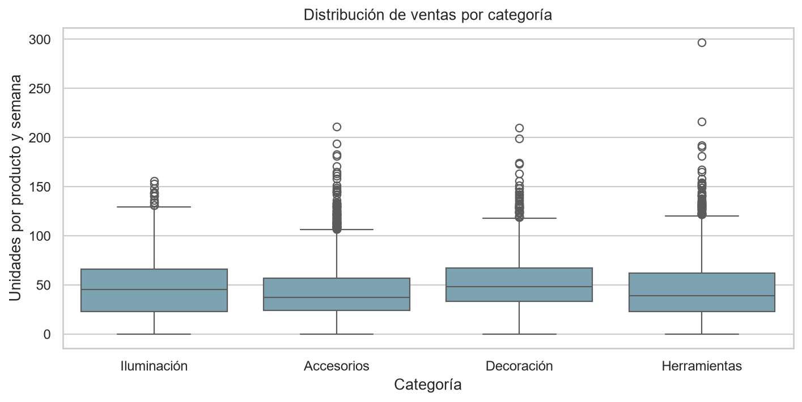
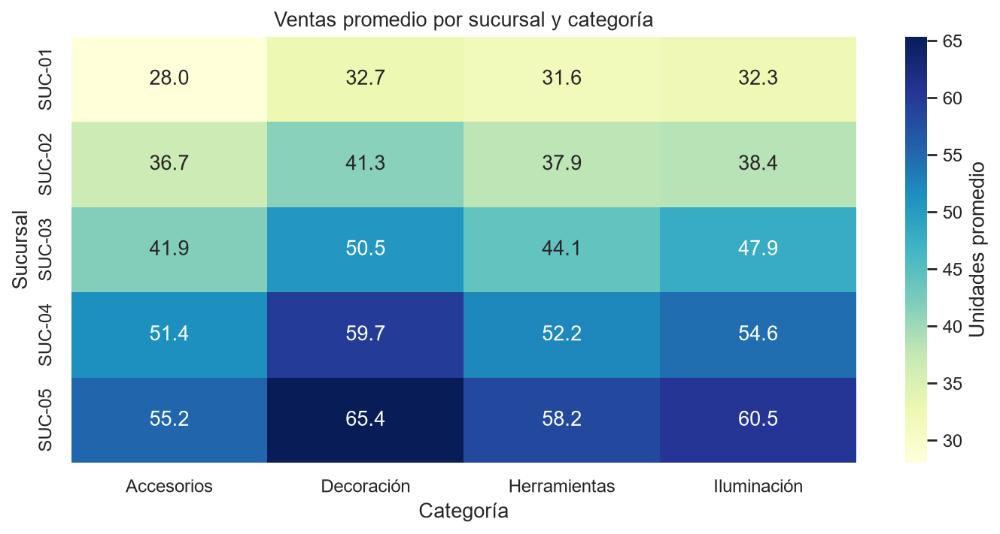
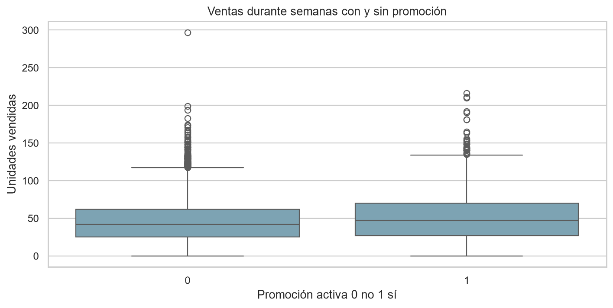
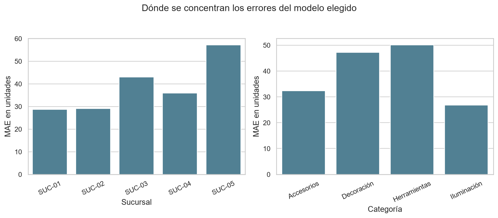
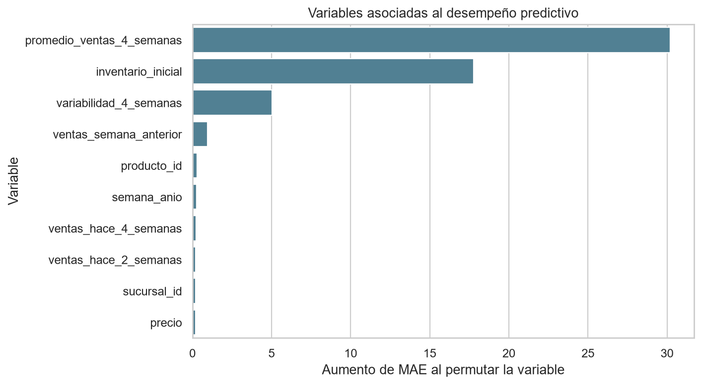

# Framework modular para pronóstico de ventas y revisión de inventario

Este reporte presenta el prototipo funcional del proyecto final de Programación para la inteligencia artificial. Mantengo el formato de instrucción seguida de respuesta. La conclusión técnica es que el flujo funciona y permite comparar una regla histórica con modelos supervisados; su adopción operativa requiere datos y costos del negocio.

Repositorio complementario: https://github.com/rubenstrada/Lumina-Framework-Proyecto-Final

Antecedente documental y técnico del Avance 2: https://github.com/rubenstrada/Dise-o-framework-

Documento y repo se entregan juntos: el documento desarrolla las respuestas y la repo contiene la configuración, el código, las pruebas y los resultados verificables.

## 1

Retoma los avances previos y ajusta la problemática, el objetivo técnico y la arquitectura del framework con base en la retroalimentación recibida.

### Respuesta

El problema que retomé es cómo aprovechar el historial de ventas e inventario de Red Comercial Boreal, con apoyo de Lumina Datos Operativos, para anticipar necesidades de revisión de existencias. En los avances previos propuse una arquitectura configurable porque el caso describía información general, sin entregar una base de datos ni confirmar columnas. Mi punto de partida sigue siendo conocer la estructura y la calidad de los datos antes de elegir un modelo.

Para cumplir la ejecución que pide esta actividad, acordé un escenario simulado de 20 productos, 5 sucursales y 104 semanas, con semilla 42. Sus columnas son decisiones del prototipo, no campos confirmados de la empresa. Esta aclaración aplica a todas las cifras, gráficas y recomendaciones de la entrega.

El objetivo técnico quedó definido como estimar las unidades vendidas acumuladas en las cuatro semanas posteriores a cada corte producto-sucursal-semana. El resultado apoyará una revisión de cobertura de inventario, sin producir órdenes de compra. Elegí ventas observadas como objetivo verificable; cuando el inventario se agota, las ventas dejan de reflejar toda la demanda y no puedo llamar demanda real a la predicción.

La retroalimentación y las decisiones de revisión se tradujeron en un contrato concreto, un generador reproducible, un flujo funcional, comparación con una regla sencilla y separación temporal. No afirmo que el docente haya pedido un algoritmo específico. La arquitectura previa se reutiliza y se amplía por composición. Esta etapa tiene una repo independiente; el Avance 2 permanece como antecedente en https://github.com/rubenstrada/Dise-o-framework-.

## 2

Desarrolla un prototipo funcional en Python. El proyecto deberá organizarse mediante funciones, clases, módulos o archivos separados que permitan reutilizar el código y facilitar su mantenimiento.

### Respuesta

El prototipo se ejecuta con una configuración YAML y genera los datos de entrada si no existe la fuente. Después carga, valida, limpia, explora, prepara variables, entrena, compara y entrega reportes. Si el CSV ya existe, lo carga sin regenerarlo ni corregir la fuente original.

Organicé los archivos por responsabilidad. Una clase agrupa una responsabilidad con métodos concretos; una función resuelve una operación puntual; un módulo es el archivo Python y un paquete reúne módulos relacionados. No necesito una clase por columna ni un archivo principal que concentre todo. En un backend anterior reuní demasiada lógica en app.py; aquí el punto de entrada solo recibe argumentos y delega.

La estructura principal es src/lumina_framework con core, data, preprocessing, visualization, modeling, reporting y pipeline. config contiene parámetros; tests verifica comportamiento; scripts inicia procesos; data conserva la fuente; artifacts contiene resultados. La separación permite cambiar un modelo o un gráfico sin reescribir la carga y la limpieza.

El comando de ejecución es `python scripts/run_final_project.py --config config/project_final.yaml`. La instalación, los requisitos y el código completo se encuentran en el README. La entrega documental explica qué hace el proyecto; el repositorio de GitHub permite ejecutarlo y revisar la evidencia.

## 3

Integra un flujo completo de trabajo que incluya:

- Carga de datos.
- Revisión de estructura y calidad de datos.
- Limpieza de valores faltantes, duplicados, inconsistencias o valores atípicos.
- Preprocesamiento de variables.
- Visualización exploratoria.
- Entrenamiento de al menos un modelo de machine learning.
- Evaluación del desempeño del modelo.
- Interpretación de resultados.
- Recomendaciones para la toma de decisiones.

### Respuesta

El flujo conecta módulos con entradas y salidas explícitas:

| Módulo y clase | Entrada | Proceso | Salida |
|---|---|---|---|
| Carga DataLoader | CSV y contrato | Carga sin mutar la fuente | DataFrame |
| Calidad DataValidator y DataCleaner | DataFrame y reglas | Revisa columnas, llaves y valores; limpia de forma conservadora | Copia limpia y bitácora |
| Perfil DataProfiler | Tabla antes y después | Calcula tipos, nulos, duplicados y estadísticas | Perfiles JSON |
| Preprocesamiento FeatureEngineer y DataPreprocessor | Historial limpio | Construye rezagos, objetivo futuro e imputación y codificación | Variables y transformador |
| Cortes TemporalDataSplitter | Variables fechadas | Separa semanas completas con espacios de cuatro semanas | Entrenamiento, validación y prueba |
| Visualización BusinessVisualizer y ModelDiagnosticsVisualizer | Tabla, predicciones y métricas | Agrega y dibuja con Matplotlib y Seaborn | Ocho figuras PNG |
| Entrenamiento ModelExperimentRunner | Cortes y parámetros | Ajusta candidatos en entrenamiento; elige en validación; reajusta | Pipelines y predicciones |
| Evaluación ModelEvaluator | Objetivo y predicciones | Calcula métricas globales, por segmento y remuestreo | Tablas e intervalo orientativo |
| Reportes ReportGenerator e InventorySignalGenerator | Resultados y stock al cierre | Serializa y genera señales para revisión | CSV, JSON, Markdown, joblib y manifiesto |
| Coordinación LuminaPipeline | Configuración y componentes | Ordena el flujo y registra eventos | RunResult |

Primero leo el CSV y reviso su estructura. La entrada tiene 10,431 filas y 8 columnas; la limpieza deja 10,369 filas, sin duplicados exactos. No tomo el archivo limpio original del generador para recuperar valores corruptos: el pipeline trabaja con la copia recibida.

| Regla | Registros afectados | Decisión |
|---|---|---|
| remove_exact_duplicates | 31 | Duplicados exactos. |
| drop_invalid_dates | 31 | La fecha no se inventa ni se recupera usando el generador. |
| normalize_categories | 31 | Espacios y mayúsculas. |
| invalidate_precio | 31 | Valores imposibles o no numéricos a faltantes; imputación del predictor se ajusta con entrenamiento. |
| invalidate_inventario_inicial | 31 | Valores imposibles o no numéricos a faltantes; imputación del predictor se ajusta con entrenamiento. |
| invalidate_unidades_vendidas | 0 | Valores imposibles o no numéricos a faltantes; imputación del predictor se ajusta con entrenamiento. |
| invalidate_sales_above_inventory | 31 | Ventas corruptas pasan a ausentes; se excluyen ventanas de etiqueta incompletas. |
| preserve_plausible_outliers | 0 | Picos dentro del inventario se conservan; no se usa un umbral aprendido del futuro. |

Conservo picos plausibles, porque un valor alto puede representar una promoción o un evento y no necesariamente un error. Los valores imposibles pasan a ausentes. Precio e inventario se imputan dentro del pipeline con la mediana aprendida del entrenamiento; las ventas ausentes no se rellenan para fabricar etiquetas. Al reindexar cada producto-sucursal por su calendario semanal, una semana perdida queda como hueco y no se confunde con la semana anterior.

Las características incluyen ventas de hace 1, 2 y 4 semanas; promedio, variabilidad y suma de las cuatro anteriores; tendencia reciente; mes y semana del año; precio, promoción e inventario observados, e identificadores categóricos. Se usa shift antes de rolling para excluir la semana actual del resumen histórico. El objetivo suma t+1 a t+4; descarto ventanas incompletas. Las características del corte son conocidas al cierre de t. No incluyo precio, promoción ni ventas futuras.

La imputación, el escalado y OneHotEncoder se ajustan solo con entrenamiento durante la selección. El codificador permite categorías nuevas sin fallar. Finalmente reajusto los candidatos seleccionados con entrenamiento más validación, antes de evaluar el periodo de prueba.

| Periodo de origen | Semanas | Filas utilizables | Función |
|---|---|---|---|
| Entrenamiento | 5 a 68 | 6,017 | Ajustar candidatos |
| Validación | 73 a 84 | 1,159 | Elegir parámetros y enfoque |
| Prueba | 89 a 100 | 1,139 | Evaluación final fuera de selección |

Las semanas 1 a 4 aportan historial; 69 a 72 y 85 a 88 permiten completar etiquetas sin cruzar el siguiente conjunto; 101 a 104 completan las etiquetas finales. Estos cortes evitan que las etiquetas superpuestas mezclen información de entrenamiento y validación. Las filas difieren del calendario ideal por las ventanas incompletas, no por una partición aleatoria.

## 4

Si la problemática requiere predicción o clasificación, implementa al menos un modelo supervisado. Si la problemática requiere segmentación, agrupamiento o reducción de dimensionalidad, implementa al menos un modelo no supervisado. Puedes integrar ambos enfoques si el caso lo justifica.

### Respuesta

La pregunta es una regresión supervisada: cada fila tiene variables disponibles en el corte y una etiqueta numérica calculada con ventas posteriores. Implementé Ridge y Random Forest, además de una referencia ingenua que pronostica la suma de las cuatro semanas previas. La referencia permite comprobar si el machine learning aporta algo frente a una regla sencilla.

Ridge es una regresión lineal regularizada que facilita revisar coeficientes y reduce inestabilidad entre variables relacionadas. Random Forest combina árboles y permite relaciones no lineales e interacciones. Ambos reciben el mismo preprocesamiento para mantener una comparación consistente; el escalado beneficia a Ridge, aunque los árboles no lo necesitan. Los pipelines encapsulan transformación y ajuste (scikit-learn developers, s. f.-a, s. f.-b).

Un modelo global aprende de todas las combinaciones, con producto y sucursal codificados. No construí cien modelos separados con pocas observaciones cada uno. Tampoco añadí clustering: agrupar datos no es el objetivo de esta decisión y hacerlo solo para aumentar técnicas complicaría la explicación.

## 5

Selecciona métricas de evaluación adecuadas para el tipo de problema. Por ejemplo, puedes utilizar exactitud, precisión, recall, F1-score, matriz de confusión, error absoluto medio, error cuadrático medio, R², silhouette score u otras métricas pertinentes. Justifica por qué seleccionaste dichas métricas.

### Respuesta

Elegí MAE como criterio principal porque expresa cuánto difiere la previsión en unidades de venta acumulada por combinación y corte. Es fácil relacionarlo con una revisión de cobertura, sin convertirlo automáticamente en dinero.

RMSE penaliza más los errores grandes y ayuda a detectar episodios con desviaciones importantes. WAPE divide la suma de errores absolutos entre el volumen real total; facilita comparar el error relativo agregado. Si el volumen total es cero, el código devuelve un valor no definido y no divide entre cero. R² describe el ajuste respecto de la media del conjunto evaluado, pero no sustituye la comparación con el pronóstico ingenuo.

También calculo la mejora porcentual de MAE frente a la referencia y errores por sucursal, categoría, producto y semana. No uso accuracy ni matriz de confusión, porque la salida es numérica y no una clase. Un menor MAE global no garantiza que cada segmento mejore ni que exista un ahorro económico.

La incertidumbre se explora remuestreando bloques móviles de cuatro semanas completas. Esto conserva parte de la dependencia de etiquetas superpuestas. Con solo doce semanas en prueba hay pocos bloques independientes; el intervalo es orientativo y no una garantía estadística de uso operativo.

## 6

Compara, cuando sea posible, al menos dos configuraciones, modelos o enfoques. Explica cuál ofrece mejores resultados y por qué, considerando tanto el desempeño técnico como la utilidad para el negocio.

### Respuesta

Comparé una referencia sencilla, tres alphas de Ridge y cuatro configuraciones de Random Forest con 300 árboles. La semilla permanece fija y los parámetros se seleccionan por MAE de validación.

| Modelo | Configuración | MAE de validación |
|---|---|---|
| Ingenuo | 4 semanas anteriores | 50.51 |
| Ridge | alpha=0.1 | 35.86 |
| Ridge | alpha=1.0 | 35.82 |
| Ridge | alpha=10.0 | 35.58 |
| Random Forest | depth=8; leaf=2 | 33.71 |
| Random Forest | depth=8; leaf=5 | 33.51 |
| Random Forest | depth=None; leaf=2 | 33.47 |
| Random Forest | depth=None; leaf=5 | 33.20 |

La regla de selección se definió antes de consultar prueba: si ningún candidato mejora la referencia en validación, conservo la referencia; si Ridge queda dentro del 2 % del mejor Random Forest y también supera la referencia, prefiero Ridge por sencillez. En esta ejecución fue elegido Random Forest, con depth=None; leaf=5 y MAE de validación 33.20. Su ventaja supera esa tolerancia, por lo que no seleccioné el modelo complejo solo por ser machine learning.

Después del reajuste con 7,176 filas, estos fueron los resultados del periodo reservado:

| Modelo | MAE unidades | RMSE unidades | WAPE | R² | Mejora MAE |
|---|---|---|---|---|---|
| Ingenuo | 51.30 | 76.56 | 26.50% | 0.464 | 0.00% |
| Ridge | 42.03 | 60.04 | 21.72% | 0.671 | 18.05% |
| Random Forest | 38.98 | 58.29 | 20.14% | 0.689 | 24.00% |

Random Forest obtuvo el menor MAE de prueba y redujo el error en 24.00 % respecto de la regla sencilla. Su MAE de 38.98 corresponde a unidades acumuladas en cuatro semanas por combinación-corte, no a error diario ni a porcentaje de exactitud.

El intervalo orientativo del 95 % para MAE del elegido menos MAE de referencia fue [-14.71, -10.27] unidades, con 1,000 remuestreos. Es favorable en este periodo, pero el escenario y el horizonte corto limitan la generalización. No modifiqué parámetros después de mirar prueba. El resultado justifica probar el enfoque con datos reales, no recomendar compras automáticas ni afirmar que el volumen de filas por sí solo exige machine learning.

## 7

Genera visualizaciones que ayuden a comprender los datos, los patrones encontrados, el desempeño del modelo o los resultados obtenidos. Las visualizaciones deben tener título, etiquetas claras y una interpretación escrita.

### Respuesta

Utilicé Matplotlib y Seaborn para explorar el comportamiento de las ventas y revisar el desempeño de los modelos. Las ocho visualizaciones presentan la evolución temporal, diferencias entre grupos y resultados del pronóstico. Cada figura incluye títulos, etiquetas claras y una interpretación relacionada con las preguntas del negocio.

#### Ventas a través del tiempo

La serie muestra niveles variables y oscilaciones recurrentes. Revisaría cobertura de cada semana antes de atribuir toda caída a menor demanda; una venta también puede caer por falta de stock.

#### Distribución por categoría

Las medianas y la dispersión no son iguales. Hay ventas altas plausibles que no se eliminaron automáticamente; revisar su contexto es mejor que tratarlas como errores por su magnitud.

#### Diferencias entre sucursales y categorías

El promedio por producto-semana permite comparar grupos sin confundirlo con el total de ventas. SUC-05 presenta promedios mayores que SUC-01; esto invita a revisar políticas diferenciadas, no a imponer el mismo nivel de inventario.

#### Ventas y promoción

La mediana de las semanas con promoción es mayor en el escenario, pero ambas distribuciones se superponen. La asociación no demuestra efecto causal; sería necesario comparar productos, periodos y disponibilidad equivalentes.

#### Desempeño de los enfoques

Random Forest presenta el menor MAE y RMSE en prueba. Separé las métricas en paneles porque WAPE tiene una escala diferente y no debe compartir eje con unidades.

#### Pronóstico y observación

El modelo sigue mejor el nivel agregado que la referencia, aunque conserva desviaciones. Cada punto suma las ventanas de cuatro semanas del mismo corte; no se deben sumar puntos sucesivos para obtener ventas anuales porque se superponen y la cobertura utilizable puede variar.

#### Error por grupo

SUC-05 concentra el MAE más alto y las categorías tampoco tienen el mismo error. Parte puede reflejar mayor volumen; antes de priorizar solo por MAE revisaría WAPE y cantidad de observaciones de cada segmento.

#### Información que utiliza el modelo

La variable con mayor aumento de MAE al permutarla es promedio_ventas_4_semanas. El historial y el inventario aportan señal predictiva; la importancia no prueba causalidad y puede repartirse entre variables correlacionadas.

## 8

Documenta tu código de manera básica mediante comentarios, nombres claros de variables, docstrings o un archivo README. La documentación debe permitir que otra persona comprenda cómo ejecutar y utilizar el prototipo.

### Respuesta

Los nombres y docstrings describen responsabilidades; los comentarios explican decisiones como excluir la semana actual de rolling o mantener huecos del calendario. El README da los comandos de instalación, ejecución y pruebas, las rutas de resultados y las limitaciones. La configuración permite cambiar la fuente y los parámetros sin modificar el punto de entrada.

Desde la raíz de la repo se crea un entorno con `python -m venv .venv`, se activa y se instala el proyecto con `python -m pip install -e .`. Se ejecuta `python scripts/run_final_project.py --config config/project_final.yaml` y se verifica con `python -m pytest -q`. Para repetir con la fuente versionada no hace falta descargar datos. El generador puede probarse por separado en los tests; no sobrescribo un CSV existente al repetir el flujo.

| Librería | Uso y justificación |
|---|---|
| pandas | CSV, DataFrames, calendarios, agrupaciones, rezagos y perfiles tabulares |
| NumPy | Generador aleatorio con semilla, arrays de predicciones y remuestreo |
| Matplotlib y Seaborn | Figuras reproducibles, etiquetas, cajas, series y mapa de calor |
| scikit-learn | Pipelines, imputación, escalado, codificación, Ridge, Random Forest y métricas |
| PyYAML | Parámetros y contrato fuera de la lógica del código |
| joblib | Conserva el pipeline ajustado; se debe cargar solo desde fuentes de confianza |
| pytest | Verifica transformaciones, métricas, cortes, errores y ejecución completa |

La solución conserva separación de responsabilidades, copias de DataFrames para no mutar entradas, errores de dominio, trazabilidad de limpieza y resultados tipados. El manifiesto registra semilla, cortes, versiones, eventos, modelo seleccionado y SHA-256 de la fuente. Las métricas CSV facilitan revisión independiente del texto.

El entorno comprobado usó Python 3.12.14, pandas 3.0.5, NumPy 2.5.3, scikit-learn 1.9.1, Matplotlib 3.11.2 y Seaborn 0.13.2. requirements-lock.txt fija las dependencias directas de esa ejecución. Hay advertencias de deprecación de Seaborn relacionadas con una API de Matplotlib; no impidieron las pruebas ni la generación de figuras.

## 9

Elabora un reporte final que explique:

- El problema abordado.
- El contexto organizacional.
- La solución propuesta.
- La arquitectura del framework.
- Los datos utilizados.
- El proceso de limpieza y preprocesamiento.
- Los modelos implementados.
- Las métricas de evaluación.
- Los principales hallazgos.
- Las recomendaciones para la toma de decisiones.
- Las limitaciones del prototipo.
- Posibles mejoras futuras.

### Respuesta

El reporte reúne el problema y el contexto del punto 1, la solución y arquitectura de los puntos 2 y 3, los modelos del 4, la evaluación de los puntos 5 y 6 y los hallazgos visuales del 7. GitHub complementa el reporte con la fuente, los scripts y los artefactos de ejecución; no sustituye las respuestas del documento.

Los datos utilizados tienen ocho campos: semana, sucursal_id, producto_id, categoria, precio, promocion, inventario_inicial y unidades_vendidas. La llave lógica es producto-sucursal-semana. Después de limpiar quedan 62 precios, 62 inventarios y 31 ventas ausentes. Mantenerlos visibles permite distinguir una corrección trazable de la imputación aprendida durante el modelado.

El hallazgo técnico principal es que la comparación supera la regla histórica en este periodo, con ventaja de Random Forest. También encontré heterogeneidad entre grupos e importancia del historial de ventas. Estos resultados son compatibles con usar un modelo global, pero no bastan para decidir su adopción empresarial.

Para apoyar decisiones, el reporte genera señales en el último corte de prueba. Compara la previsión con inventario al cierre, calculado como inventario inicial menos ventas de la semana. 96 combinaciones requieren revisión: 94 por brecha y 2 por inventario desconocido. La cobertura es 96 de 100 combinaciones; las restantes carecen de ventana utilizable y su ausencia no representa ausencia de riesgo. Una brecha positiva indica revisar existencias, reposiciones pendientes y condiciones del producto; no implica comprar esa diferencia, porque faltan plazos, pedidos en tránsito, costos y demanda no atendida.

Mi recomendación es validar primero el contrato operativo, probar varios periodos históricos y usar la referencia sencilla como alternativa permanente. Si la mejora no compensa costo de mantenimiento y de errores, sería razonable mantener una política simple. El tamaño de la tabla no determina por sí solo la conveniencia de machine learning.

Las limitaciones son dos años de historial, una sola semilla de escenario, doce semanas de prueba, ventas censuradas por inventario y ausencia de costos y futuras campañas. Los promedios agregados ocultan diferencias por producto; el análisis de promociones no identifica causalidad. El pipeline evalúa cortes históricos con etiqueta conocida, no constituye todavía un servicio de pronóstico en vivo.

Como mejoras futuras propongo validación temporal en varios cortes, un camino de inferencia para semanas recientes sin etiqueta futura, medición de faltantes de venta, reposiciones y lead time, costos diferenciados de exceso y faltante, revisión de drift y monitoreo por segmento. No sumaría predicciones superpuestas ni multiplicaría MAE por semanas para inventar un ahorro anual.

## 10

Incluye evidencia suficiente de trabajo propio. Debes incorporar al menos cinco de los siguientes elementos:

- Capturas de ejecución del código.
- Repositorio, carpeta o estructura de archivos del proyecto.
- Fragmentos de código explicados por ti.
- Bitácora de decisiones técnicas.
- Comparación de modelos o configuraciones.
- Registro de errores y ajustes realizados.
- Interpretación personal de resultados.
- Explicación de cambios realizados a partir de retroalimentación.
- Pruebas realizadas con distintos datos o parámetros.
- Reflexión final sobre aprendizajes obtenidos.

### Respuesta

Presento ocho tipos de evidencia rastreables que relacionan las decisiones de diseño, la implementación y las comprobaciones del proyecto.

| Evidencia | Ubicación | Qué permite comprobar |
|---|---|---|
| Repo y estructura | README y src/lumina_framework | Separación de responsabilidades y archivos ejecutables |
| Código explicado | preprocessing/features.py y modeling/experiment.py | Rezagos antes de rolling y selección con validación |
| Decisiones técnicas | docs/evidencia_final/execution_log.md | Alcance, objetivo, cortes y regla de selección |
| Comparación | validation_metrics.csv y test_metrics.csv | Parámetros probados y desempeño fuera del ajuste |
| Errores y ajustes | Tests y registro de ejecución | Fechas inválidas, faltantes, categorías nuevas y fallo de escritura |
| Interpretación personal | Puntos 6, 7 y 9 | Diferencia entre resultado técnico y decisión de negocio |
| Cambios de los avances | Punto 1 y nueva repo | Paso de diagnóstico conceptual a flujo comprobable |
| Pruebas y reflexión | tests y este punto | Repetibilidad, métricas conocidas y aprendizaje |

En features.py, `shift(1)` mueve la venta una semana antes de calcular la ventana; así el promedio no incluye el dato del corte. Reindexar el calendario hace que el rezago sea una semana real, no simplemente la fila anterior. En experiment.py, las configuraciones compiten en validación; prueba permanece fuera de la selección. Entender esas dos decisiones importa más que acumular algoritmos.

La ejecución registrada aprobó 58 pruebas; el resultado estructurado se conserva en docs/evidencia_final/test_results.xml. Las pruebas comprueban valores de métricas conocidos, WAPE con volumen cero, cambios futuros que no modifican características previas, categorías no vistas, cortes semanales completos y repetición del experimento. La prueba de integración carga el modelo guardado y compara sus predicciones con las reportadas. Un fallo de escritura provocado debe producir un error, sin declarar una ejecución completada.

Mi aprendizaje fue precisar la unidad de observación y lo que el modelo realmente predice antes de entrenarlo. Una tabla con muchas filas puede contener poco historial independiente; por eso decidí comparar con una regla simple y conservar la cautela sobre el beneficio económico. También mantuve la organización por carpetas para evitar repetir la concentración de lógica de mi backend anterior.

## 11

Incluye una declaración de autoría y uso responsable de herramientas digitales o de inteligencia artificial. En esta declaración deberás especificar:

- Qué herramientas utilizaste.
- Para qué las utilizaste.
- Qué partes del proyecto fueron desarrolladas directamente por ti.
- Cómo verificaste, probaste o adaptaste cualquier apoyo recibido.
- Qué decisiones técnicas fueron tomadas con base en tu propio análisis.

### Respuesta

Mi punto de partida fue comprender la lógica del negocio y definir qué problema debía resolver el framework antes de escribir código. Ya había trabajado con modelos, por lo que primero necesitaba establecer qué información analizar, qué resultado obtener y cómo podría utilizarse para tomar decisiones.

En este caso, relacioné el historial de ventas con la revisión del inventario por producto y sucursal. Comprendí que las ventas registradas no representan necesariamente toda la demanda: si se agota el inventario, pueden existir necesidades de compra que no quedan reflejadas en las ventas. Por eso delimité el objetivo como pronosticar ventas observadas y generar señales de revisión, sin presentar las predicciones como órdenes automáticas de compra.

Antes de evaluar modelos necesitaba explorar los datos y comprender su comportamiento. Revisar columnas, tipos, frecuencia temporal, faltantes, duplicados y diferencias entre grupos permite identificar qué información es utilizable y qué transformaciones requiere. También consideré que un valor alto puede corresponder a un comportamiento válido del negocio, por lo que no debía eliminarse automáticamente por parecer atípico.

Codex me ayudó a explorar alternativas y discutir horizontes de predicción. Las decisiones finales las tomé después de relacionar esas alternativas con el objetivo del proyecto. Definí un horizonte de cuatro semanas para obtener una salida concreta y comparable. También consideré necesario comparar los modelos con una regla histórica sencilla: tener muchas filas o utilizar machine learning no demuestra, por sí solo, que la solución aporte valor.

La organización del framework surgió de experiencias anteriores. En un backend de ERP había concentrado demasiada lógica en archivos como app.py, lo que dificultaba localizar responsabilidades y modificar componentes. Esa experiencia influyó en mi decisión de separar carga, validación, limpieza, preprocesamiento, visualización, modelado, evaluación y reportes. Tenía claro cómo quería organizar la solución y qué responsabilidad debían tener sus componentes, métodos y funciones.

Utilicé Codex para acelerar la escritura del código, desarrollar las definiciones que fui estableciendo y apoyar la revisión y las comprobaciones de la implementación. El trabajo fue iterativo: discutí alternativas, indiqué los comportamientos esperados y solicité ajustes para mantener la organización y el alcance que buscaba. Codex también apoyó la ejecución de pruebas automatizadas y la preparación de la documentación.

El apoyo se adaptó al contrato de datos, al objetivo de cuatro semanas y a la comparación con una referencia sencilla. La implementación se comprobó mediante ejecución nativa, pruebas, recarga del pipeline guardado y revisión de figuras y artefactos. La bitácora conserva decisiones y ajustes; las comprobaciones se realizaron con asistencia de Codex.

Las pruebas y los resultados permiten comprobar el funcionamiento técnico. Mi responsabilidad es comprender y explicar cómo se construyen las variables, por qué se respeta el orden temporal, cómo se comparan los modelos y qué limitaciones tienen sus resultados. La IA fue una herramienta de apoyo dentro de ese proceso; las decisiones finales sobre el problema, el alcance y la organización permanecieron bajo mi criterio.

Para desarrollar y verificar el prototipo utilicé Python, pandas, NumPy, scikit-learn, Matplotlib, Seaborn, PyYAML, joblib y pytest. Git y GitHub conservan y presentan la evidencia; Microsoft Word se utilizó para el documento. Las figuras son salidas de Matplotlib y Seaborn ejecutadas sobre los datos del proyecto.

## 12

No se aceptará como proyecto final una entrega generada íntegramente por inteligencia artificial, sin ejecución comprobable, sin explicación personal, sin evidencia de pruebas o sin adaptación al caso seleccionado. El estudiante deberá demostrar comprensión del código, de los resultados y de las decisiones tomadas.

### Respuesta

La entrega relaciona las decisiones de negocio y de diseño con un prototipo ejecutado, una fuente de entrada, pruebas de comportamiento, comparación de parámetros, métricas y figuras reconstruibles. La configuración y las limitaciones mantienen el objetivo que definí para el framework.

Puedo explicar por qué el proyecto pronostica ventas observadas, por qué los cortes respetan el tiempo y por qué una señal de inventario requiere revisión antes de tomar una decisión de compra. El reporte desarrolla esas relaciones y la guía de comprensión permite seguirlas en el código y en sus resultados.

El repositorio permite revisar y repetir las comprobaciones. La declaración de herramientas describe cómo utilicé Codex durante la implementación y la verificación. Mi responsabilidad sobre el resultado incluye revisar el código, interpretar sus salidas y justificar las decisiones del proyecto.
## Referencias

pandas development team. (s. f.). *pandas documentation*. Recuperado el 2 de octubre de 2026, de https://pandas.pydata.org/docs/

scikit-learn developers. (s. f.-a). *Ridge*. Recuperado el 2 de octubre de 2026, de https://scikit-learn.org/stable/modules/generated/sklearn.linear_model.Ridge.html

scikit-learn developers. (s. f.-b). *RandomForestRegressor*. Recuperado el 2 de octubre de 2026, de https://scikit-learn.org/stable/modules/generated/sklearn.ensemble.RandomForestRegressor.html

scikit-learn developers. (s. f.-c). *Common pitfalls and recommended practices*. Recuperado el 2 de octubre de 2026, de https://scikit-learn.org/stable/common_pitfalls.html

Universidad Tecmilenio. (2026). *Predicciones bajo presión El desafío analítico de Lúmina Datos Operativos* [Caso práctico proporcionado en el curso].

Waskom, M. L. (2021). seaborn: Statistical data visualization. *Journal of Open Source Software, 6*(60), 3021. https://doi.org/10.21105/joss.03021
